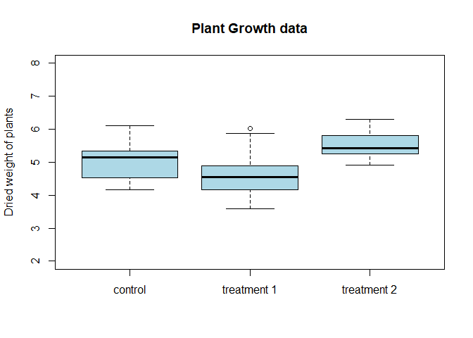
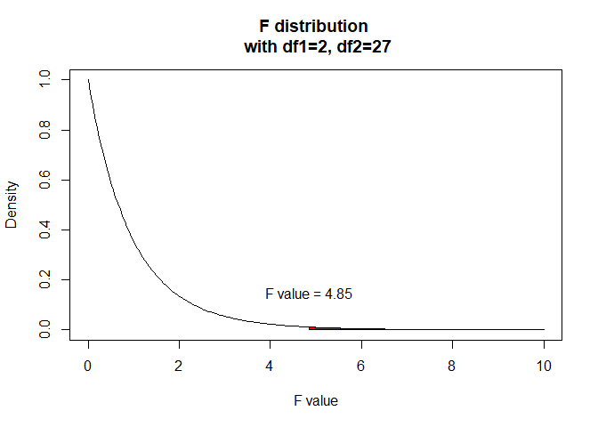
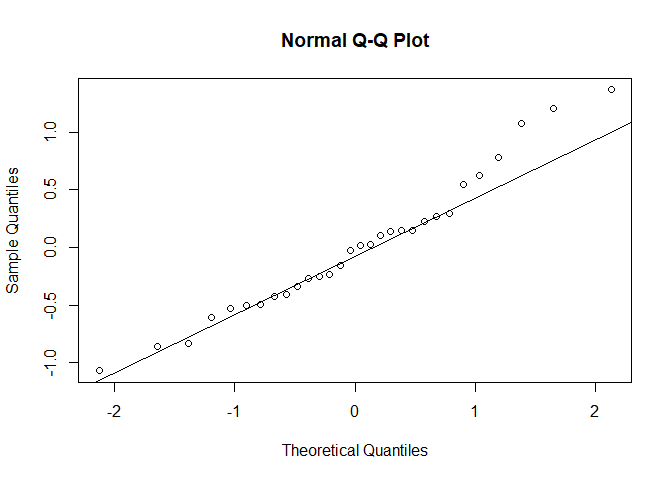

Analysis of Variance (ANOVA)
================
Andreas Kitsche

One-way ANOVA
-------------

Analysis of variance, ANOVA, is a method of comparing means based on variations from the mean. A one-way analysis of variance is a generalization of the t-test for two independent sample, allowing us to compare means for several independent samples from normally distributed populations.

The data set `PlantGrowth` (available from the R data base) contains the results from an experiment to compare yields (as measured by dried weight of plants) obtained under a control and two different treatment conditions. A researcher want's to know, if there is a difference in mean weight for the three different conditions. We use a one-way analysis of variance to anwser this question. First, we display the data using a boxplot to examine the distribution of each treatment group:



We will further calculate some summary statistics for each group:

``` r
aggregate(weight ~ group, data = PlantGrowth,FUN=length)
```

    ##   group weight
    ## 1  ctrl     10
    ## 2  trt1     10
    ## 3  trt2     10

``` r
aggregate(weight ~ group, data = PlantGrowth,FUN=mean)
```

    ##   group weight
    ## 1  ctrl  5.032
    ## 2  trt1  4.661
    ## 3  trt2  5.526

``` r
aggregate(weight ~ group, data = PlantGrowth,FUN=median)
```

    ##   group weight
    ## 1  ctrl  5.155
    ## 2  trt1  4.550
    ## 3  trt2  5.435

``` r
aggregate(weight ~ group, data = PlantGrowth,FUN=sd)
```

    ##   group    weight
    ## 1  ctrl 0.5830914
    ## 2  trt1 0.7936757
    ## 3  trt2 0.4425733

``` r
aggregate(weight ~ group, data = PlantGrowth,FUN=var)
```

    ##   group    weight
    ## 1  ctrl 0.3399956
    ## 2  trt1 0.6299211
    ## 3  trt2 0.1958711

To calculate the ANOVA in R we can use the `aov()` function:

``` r
summary(aov(weight ~ group, data = PlantGrowth))
```

    ##             Df Sum Sq Mean Sq F value Pr(>F)  
    ## group        2  3.766  1.8832   4.846 0.0159 *
    ## Residuals   27 10.492  0.3886                 
    ## ---
    ## Signif. codes:  0 '***' 0.001 '**' 0.01 '*' 0.05 '.' 0.1 ' ' 1

 Furthermore we can check the assumptions that the samples come from normally distributed populations with the same standard deviation. We can construct a QQ-plot of the residuals to assess the assumptiom of normality. 
