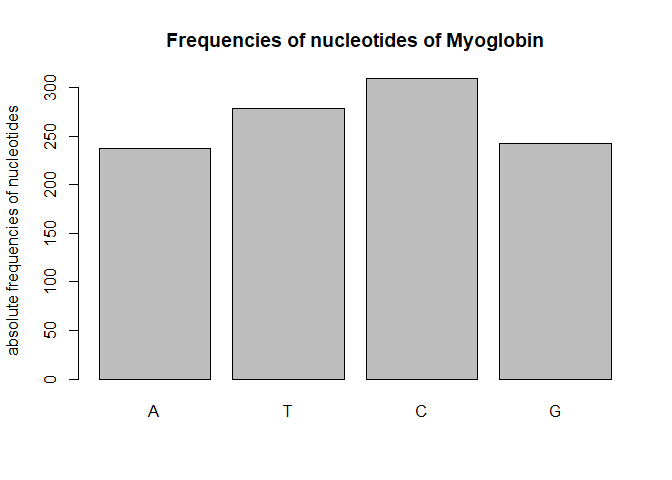
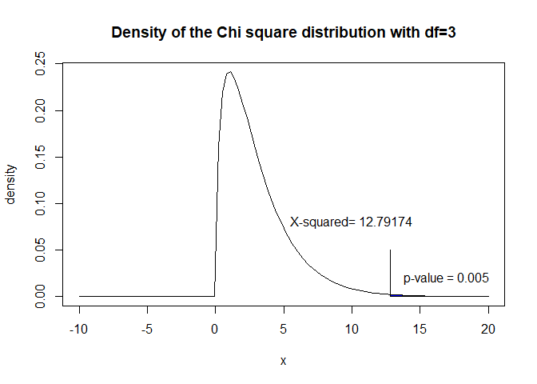

Contingency Tables and Categorical Data
================
Andreas Kitsche

When a sample of *n* observations in two qualitative (categorical) variables are available, they can be arranged into a cross-classification in which the number of observations falling in each cell of the table is recorded. This table is also denoted as contingency table, in which the observations for a sample of individuals or objects are cross-classified whith respect to two categorical variables. Testing for the independence of the two variables *x* and *y* is of most interest in general.

Under the null hypothesis of independence of the row variable *x* and the column variable *y*, estimated expected values *E*<sub>*j**k*</sub> for cell (*j*, *k*) can be computed from the corresponding margin totals *E*<sub>*j**k*</sub> = *n*<sub>*j*.</sub>*n*<sub>.*k*</sub>/*n*<sub>.</sub>. The test statistic for assessing independence is

$$
\\chi^{2}=\\sum\_{j=1}^{r}\\sum\_{k=1}^{c}\\frac{(n\_{jk}-E\_{jk})^2}{E\_{jk}}
$$
 Under the null hypothesis of independence, the test statistic *χ*<sup>2</sup> is asymptotically distributed according to a *χ*<sup>2</sup>-distribution with (*r* − 1)(*c* − 1)degrees of freedom, the corresponding test is usually known as chi-squared test.

Example - Goodness of fit test (One-variable *χ*<sup>2</sup>-test)
------------------------------------------------------------------

We think that the proportion of nucleotides A, T, C, G should be equally present in a given DNA sequence, with proportion 0.25 for each. Let's see for a particular gene how good this fit really is. For this example we will use the sequence for human myoglobin, a muscle protein which carries oxygen. The obtained number of each nucleotide is A-237, T-278, C-309, G-242. Formulate an appropriate null and alternative hypothesis:

$$
H\_{0}:\\hspace{0.5cm} \\pi\_{A}=0.25\\hspace{0.5cm}  \\pi\_{G}=0.25\\hspace{0.5cm} \\pi\_{C}=0.25\\hspace{0.5cm} \\pi\_{T}=0.25
$$

$$
H\_{A}:\\hspace{0.5cm} H\_{0} \\hspace{0.5cm} is\\hspace{0.5cm} false
$$

Plotting the frequency of each nucleotide using the `barplot()` function

``` r
obs <- c(237, 278, 309, 242)
barplot(obs, ylab = "absolute frequencies of nucleotides", main = "Frequencies of nucleotides of Myoglobin", 
    names.arg = c("A", "T", "C", "G"))
```



Calculating the corresponding chi square test with R

``` r
expected <- c(0.25, 0.25, 0.25, 0.25)
chisq.test(obs, p = expected)
```

    Chi-squared test for given probabilities

data: obs X-squared = 12.792, df = 3, p-value = 0.005109 
