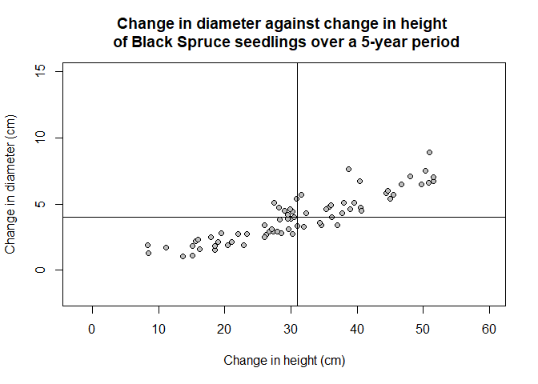
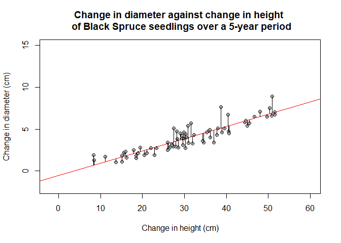
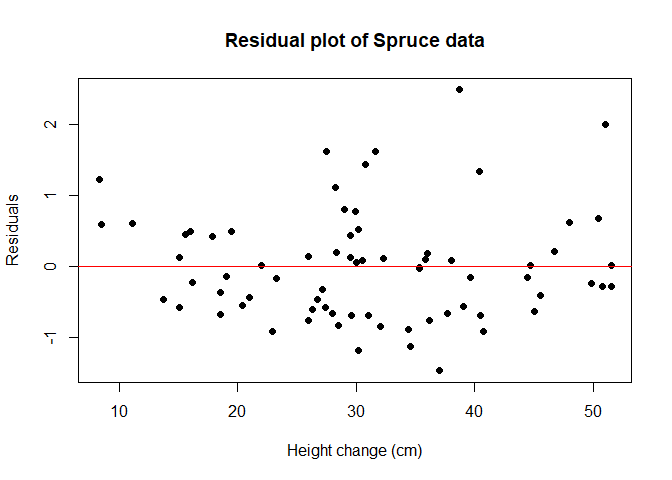
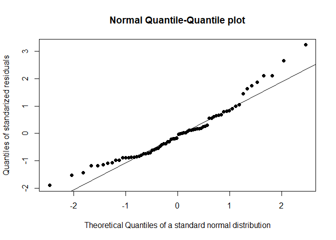

Correlation and Regression
================
Andreas Kitsche

Correlation
-----------

Correlation metrics are measures of associations between variables. Correlation is a numeric measure of the strength of a linear relationship between two numeric variables. Correlation metrics have values between 1 and -1 where 1 is a perfect positive correlation, -1 is a perfect negative correlation, and 0 implies there is no correlation. The commonly used correlation coefficient according to Pearson is calculated by
$$
r = \\frac{\\frac{1}{n-1}\\sum\_{i=1}^{n}(x\_{i}-\\bar{x})(y\_{i}-\\bar{y})}{\\sqrt{\\frac{1}{n-1}\\sum\_{i=1}^{n}(x\_{i}-\\bar{x})^{2}}\\sqrt{\\frac{1}{n-1}\\sum\_{i=1}^{n}(y\_{i}-\\bar{y})^{2}}}
$$
 The data set `Spruce` contains the observations on 72 black spruce seedlings. Black spruce (Picea mariana) is a species of low-growing coniferious tree found across the northern part of North America. It is commonly found on wet organic soils. Black spruce seedlings were planted in four plots under varying conditions and their heights and diameters were measured over the course of 5 years.



Regression
----------

We now characterize a linear relationship between two variables by determining the "best" line that describes the relationship. In most cases we pick the line *y* = *a* + *b**x* to make the vertical distances from observations to the line small.



R provides the function to fit a linear regression model.

``` r
Spruce.lm <- lm(DiameterChange ~ HeightChange, data=Spruce)
Spruce.lm
```

    ## 
    ## Call:
    ## lm(formula = DiameterChange ~ HeightChange, data = Spruce)
    ## 
    ## Coefficients:
    ##  (Intercept)  HeightChange  
    ##      -0.5189        0.1459

You can also get some useful parameters of your fitted model with the functions:

-   coefficients() - a named vector of coefficients
-   fitted.values() - the fitted mean values
-   residuals() - the residuals, that is response minus fitted values
-   predict() - predicted values based on linear model object
-   summary() - print a summary of the fitted model object

``` r
summary(Spruce.lm)
```

    ## 
    ## Call:
    ## lm(formula = DiameterChange ~ HeightChange, data = Spruce)
    ## 
    ## Residuals:
    ##      Min       1Q   Median       3Q      Max 
    ## -1.46403 -0.58148 -0.07799  0.43855  2.48473 
    ## 
    ## Coefficients:
    ##               Estimate Std. Error t value Pr(>|t|)    
    ## (Intercept)  -0.518904   0.273914  -1.894   0.0623 .  
    ## HeightChange  0.145949   0.008346  17.488   <2e-16 ***
    ## ---
    ## Signif. codes:  0 '***' 0.001 '**' 0.01 '*' 0.05 '.' 0.1 ' ' 1
    ## 
    ## Residual standard error: 0.777 on 70 degrees of freedom
    ## Multiple R-squared:  0.8138, Adjusted R-squared:  0.8111 
    ## F-statistic: 305.8 on 1 and 70 DF,  p-value: < 2.2e-16

The simple linear regression model assumes that the relationship between the response and explanatory variable is linear. We can check this assumption via plotting a residual plot. This is a plot of $y\_{i}-\\hat{y\_{i}}$ against *x*<sub>*i*</sub>. The residual is the difference between observed *y* value and the corresponding fitted value: it provides information on how far off the straight line is in predicting the *y*<sub>*i*</sub> value at a particular data point *x*<sub>*i*</sub>. If the residual is positive, then the predicted value is an underestimate, whereas if the residual is negative, then the predicted value is an overestimate. The plot of residuals against the predictor variable provides visual information on the appropriateness of a straight line model. Ideally, points should be scattered randomly about the reference line *y* = 0.



A further assumption of the simple linear regression is, that the observations *y*<sub>*i*</sub> derived from a normal distribution. This can be checked with a Normal-Quantile plot of the standardized residuals:


