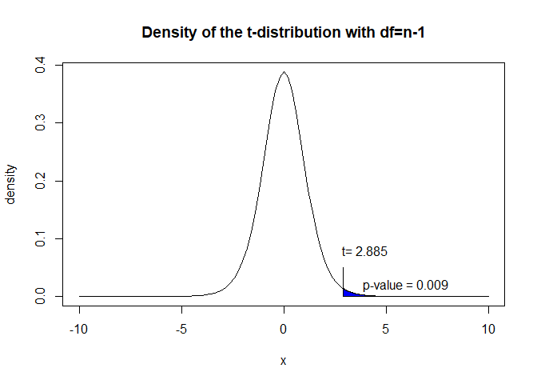

Hypothesis testing - t-test
================
Andreas Kitsche

The core idea of statistical significance or classical hypothesis testing is - to calculate how often pure random chance would give an effect as large as that observed in the data, in the absence of any real effect. If that probability is small enough, we conclude that the data provide convincing evidence of a real effect. Here we want to review the basic ideas of hypothesis testing using the t-test and the data set `PlantGrowth` from the R data base.

One sample t-test
-----------------

We assume the research question is to check, if the mean weight of the control plants (measured by dried weight of plants) is greater than 4.5. So we have to type an appropriate null and alternative hypothesis. Remember the following definitions:

-   null hypothesis - denoted *H*<sub>0</sub>, is a statement that corresponds to no real effect
-   alternative hypothesis - denoted *H*<sub>*A*</sub>, is a statement that there is a real effect

A hypothesis should involve a statement about a population parameter.

$$ H\_{0}:\\mu=\\mu\_{0} \\hspace{3cm} H\_{A}: \\mu &gt; \\mu\_{0} $$

*H*<sub>0</sub>

where *μ*<sub>0</sub> = 4.5 The next two ingedients in hypothesis testing are a numerical measure of the effect and the probability that chance alone could produce that measure.

-   test statistic - A test statistic is a numerical function of the data whose value determines the result of the test.
-   p-value - is the probability that chance alone would produce a test statistic as extreme as the observed test statistic.

We now assume that our data are independent data, that derived from a normal distribution with the parameters *μ* and *σ*. Then an appropriate test statistic is:
$$
test statistic = t = \\frac{\\overline{x}-\\mu\_{0}}{s/ \\sqrt{n}}
$$
 where $\\overline{x}$ is the sample mean, *s* is the sample standard deviation and *n* is the number of independent observations. Under the null hypothesis (no effect), the test statistic has a t-distribution with (n-1) degrees of freedom. The p-value is the probability that chance alone would produce a test statistic as extreme as or more extreme than the observed value t, if the null hypothesis is true.



In R it is easy to calculate the t-test using the `t.test()` function:

``` r
t.test(data1, alternative="greater", mu=4.5)
```

    ## 
    ##  One Sample t-test
    ## 
    ## data:  data1
    ## t = 2.8852, df = 9, p-value = 0.009012
    ## alternative hypothesis: true mean is greater than 4.5
    ## 95 percent confidence interval:
    ##  4.693993      Inf
    ## sample estimates:
    ## mean of x 
    ##     5.032
