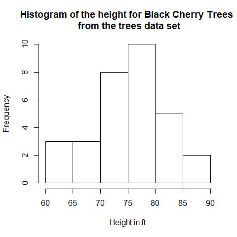
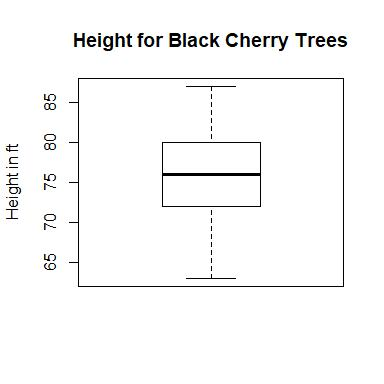
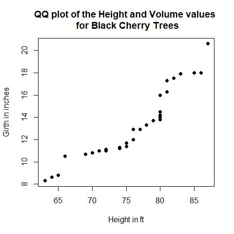
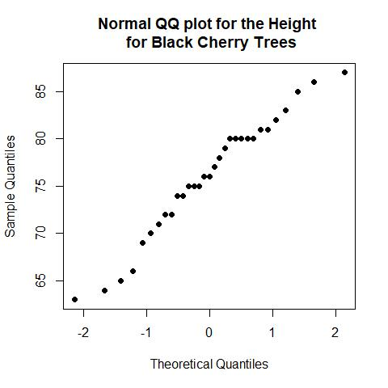

Tutorial - Analyzing data
================
Andreas Kitsche

Summary statistics
==================

R includes a number of functions for calculating summary statistics for a given set of data. The following list presents the most useful ones:

-   mean(x,...) - calculates the mean of a numeric vector
-   min() - calculates the minimum
-   max() - calculates the maximum
-   range() - returns a vector containing the minimum and maximum
-   median() - computes the sample median
-   quantile(x,...) - produces sample quantiles corresponding to the given probabilities
-   IQR() - computes interquartile range
-   fivenum() - Returns Tukey's five number summary (minimum, lower-hinge, median, upper-hinge, maximum). (The lower hinge is the median of the lower half of the data up to and including the median. The upper hinge is the median of the upper half of the data up to and including the median.)
-   summary() - presents information about each variable in the data frame. For numeric values, it shows the minimum, 1st quartile, median, mean, 3rd quartile, and maximum value. For factors, it shows the count of the most frequent values
-   var() - computes the variance of a numeric vector
-   sd() - computes the standard deviation of a numeric vector
-   sum() - computes the sum of a numeric or complex or logical vector
-   prod() - computes the product of a numeric or complex or logical vector

Graphical representation
========================

Histogram
---------

A histogram is used to show the frequency distribution of a collection of numbers. Each bar represents the count of x values that fall in the range indicated by the base of the bar. Usually all bars should be the same width; this is the default in R. In this case the height of each bar is proportional to the number of observations in the corresponding interval. In R, `hist(x,...)` is the main way to plot a histogram, e.g.

``` r
data(trees)
hist(trees$Height, main="Histogram of the height for Black Cherry Trees \n from the trees data set", xlab="Height in ft")
```



Boxplot
-------

The boxplot (also box-and-whisker plot) is a quick way of examining one or more sets of data graphically. A rectangular box is drawn, together with lines which protrude from two opposing sides. The box gives an indication of the location and spread of the central portion of the data, while the extend of the lines (the "whiskers") provides an idea of the range of the bulk of the data. A boxplot is a graphical representation of Tukey's five number summary statistic.

``` r
data(trees)
boxplot(trees$Height, main="Height for Black Cherry Trees", ylab="Height in ft")
```



QQ plot
-------

Quantile-Quantile plots (otherwise known as QQ plots) are a type of scatterplot used to compare the distributions of two groups to compare a sample with a reference distribution. \\ In the case where there are two goups of equal size, the QQ plot is obtained by first sorting the observations in each group. Next, draw a scatterplot of the sorted values. R provides the function `qqplot` for plotting two samples:\\

``` r
data(trees)
qqplot(trees$Height, trees$Girth, main="QQ plot of the Height and Volume values \n for Black Cherry Trees", pch=19, ylab="Girth in inches", xlab="Height in ft")
```



When plotting a single sample against a reference distribution, theoretical quantiles are used for one coordinate. R normally puts the theroretical quantiles on the x-axis and the data on the y-axis. The quantiles are chosen corresponding to probabilities (*i* − 1/2)/*n*, for *i* = 1, …, *n*. R provides the function `qqnorm` to plot the quantiles of a single sample against the corresponding quantiles of the normal distribution.

``` r
data(trees)
qqnorm(trees$Height, main="Normal QQ plot for the Height \n for Black Cherry Trees", pch=19)
```



``` r
qqline(trees$Height)
```


When the distributions of X and Y match, the points in the QQ plot will lie near the line x=y. On the other hand, if the two distributions are not the same, we will see systematic patterns in the QQ plot. If the graph in a nrmal QQ plot looks like a straight line then the data is approximately normal. The function `qqline` draws a reference line through points formed by the first and third quantiles.
