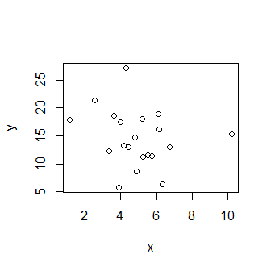
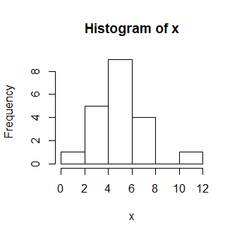
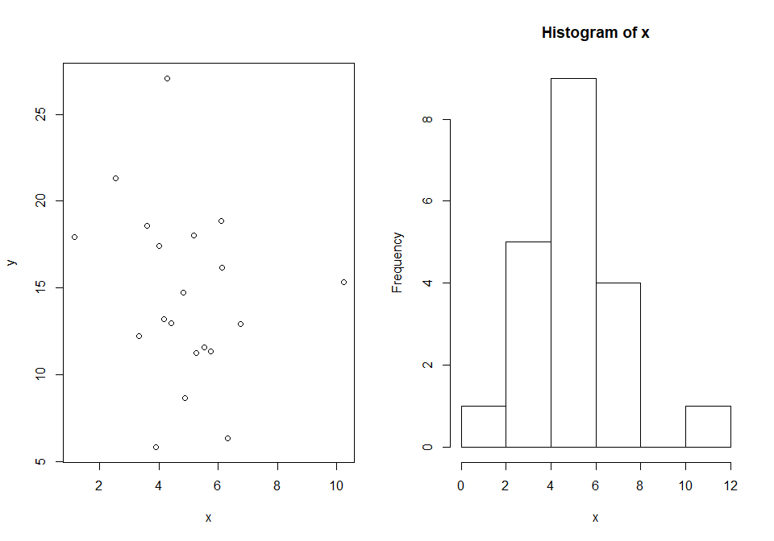
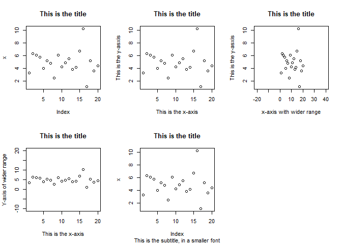
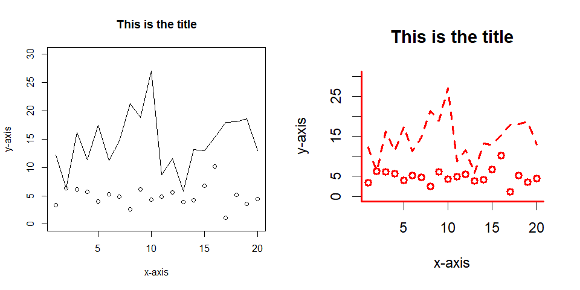

Introduction to R (Graphics)
================
Andreas Kitsche

General remarks
---------------

In this section we will create some simple graphics with R. R offers a remarkable variety of graphics. Unfortunately it is not possible to give a fast overview over the huge variety of graphics R provides (see i.e. `demo(graphics)`). \\ The result of a graphical function is sent to a graphical device. A graphical device is a graphical window or a file. There are two kinds of graphical functions: the high-level plotting functions which create a new graph, and the low-level plotting functions which add elements to an existing graph. The graphs are produced with respect to graphical parameters which are defined by default and can be modified with the function `par()`.\\ One of the most frequently used plotting functions in R is the `plot()` function. This is a generic function: the type of plot produced is dependents on the type or class of the first argument. If x and y are vectors, `plot(x, y)` produces a scatterplot of y against x:

``` r
x <- c(3.34,  6.32,  6.13,  5.74,  4.00,  5.25,  4.81,  2.55,  6.11,  
       4.28,  4.88,  5.54,  3.89,  4.17,  6.76, 10.23,  1.14, 5.19,  3.61,  4.42)
y <- c(12.24,  6.32, 16.17, 11.35, 17.41, 11.24, 14.71, 21.34, 18.84, 
       27.09,  8.67, 11.59,  5.81, 13.21, 12.93, 15.35, 17.93, 18.04, 18.59, 12.95)
plot(x,y)
```



A histogram can be plotted by the `hist()` function:

``` r
hist(x)
```





For each plotting function the options may be found with the on-line help in R. Some of these options are identical for several graphical functions; here are the main ones (with their possible default values): The `type=` argument specifies the type of plot

-   type="p" - points
-   type="l" - lines
-   type="b" - points connected by lines (both)
-   type="o" - points connected by lines, but the lines are over the points
-   type="h" - vertical lines
-   type="s " - steps, the data are represented by the top of the vertical lines

``` r
par(mfrow=c(2,3)) #Subsequent figures will be drawn in an 2 by 3 array on the device
plot(x, type="p", main="type=p")
plot(x, type="l", main="type=l")
plot(x, type="b", main="type=b")
plot(x, type="o", main="type=o")
plot(x, type="h", main="type=h")
plot(x, type="s", main="type=s")
```


Arguments specifying the axes and the title are:

-   xlim=, ylim= - specifies the lower and upper limits of the axes
-   xlab=,ylab= - anotates the axes, must be variables of mode character
-   main= - main title, must be a variable of mode character
-   sub= - sub-title

``` r
par(mfrow=c(2,3))
plot(x, main="This is the title")
plot(x, xlab="This is the x-axis", 
        ylab="This is the y-asxis", 
        main="This is the title")
plot(x, xlab="x-axis with wider range",
        xlim=c(-20,40), 
        ylab="This is the y-asxis", 
        main="This is the title")
plot(x, xlab="This is the x-axis", 
        ylab="Y-axis of wider range",
        ylim=c(-10,20), 
        main="This is the title")
plot(x, main="This is the title", 
        sub="This is the subtitle, in a smaller font")
```



Low level plotting commands
---------------------------

R has a set of graphical functions which affect an already existing graph: they are called low-level plotting commands. Here are the main ones:

-   points(x,y) - adds points (the option type can be used)
-   lines() - adds connected line segments to a plot
-   abline(a,b) - draws a line of slope b and intercept a
-   abline(h=y) - draws a horizontal line at ordinate y
-   abline(v=x) - draws a vertical line at abcissa x
-   text(x,y,labels,...) - draws the strings given in the vector labels at the coordinates given by x and y
-   legend(x,y,legend) -adds the legend at the point (x,y) with the symbols given by legend
-   title() - adds a title and optionally a sub-title
-   locator - returns the coordinates (x; y) after the user has clicked on the plot with the mouse

``` r
par(mfrow=c(2,3))
plot(x, ylim=c(0,30),
        main="points of y values \n added with function points()")
points(y, col="blue")
plot(x, ylim=c(0,30),
        main="lines of y values \n added with function lines()")
lines(y)
plot(x, ylim=c(0,30),
        main="lines added with \n function abline()")
abline(0,1)
abline(h=10)
abline(v=15)
plot(x, ylim=c(0,30), 
        main="text of y values \n added with function text()")
text(1:20, y, 
          labels(1:20))
plot(x, ylim=c(0,30), 
      main="legend added for specifying\n  x and y vales (legend())")
lines(y)
legend(2,30, legend=c("x - points","y - lines"))
plot(x, ylim=c(0,30))
title(main="Title drawn with\n  function title()")
```


Graphical parameters
--------------------

When creating graphics the default settings do not produce exactly what is required. You can customize the graphical parameters. The `par()` function is used to access and modify the list of graphics parameters for the current graphics device. Using the help page of `par()` to get an overview of the 73 graphical parameters:

``` r
help(par)
```

The list below will show the most usual ones:

-   bg - the color to be used for the background of the device region, the list of the 657 available colours is displayed with colors()
-   bty - controls the type of box drawn around the plot
-   cex - a value controlling the size of texts and symbols with respect to the default
-   col - controls the colour of symbols
-   font - an integer which controls the style of text (1: normal, 2: italics, 3: bold, 4: bold italics)
-   lty - controls the type of lines, can be an integer (1: solid, 2: dashed, 3: dotted, 4: dotdash, 5: longdash, 6: twodash)
-   lwd - a numeric which controls the width of lines
-   mfrow - a vector of the form c(nr,nc) which partitions the graphic window as a matrix of nr lines and nc columns, the plots are then drawn in rows
-   pch - controls the type of symbol, an integer between 1 and 25

The figure above with modified labels is given by:

``` r
par(mfrow=c(1,2))
plot(x, main="This is the title", 
        xlab="x-axis", 
        ylab="y-axis", 
        ylim=c(0,30))
lines(y)
par(bty="l", cex=1.5, col="red", font=3, lty="dashed", lwd=3)
plot(x, main="This is the title", 
        xlab="x-axis", 
        ylab="y-axis", 
        ylim=c(0,30))
lines(y)
```


